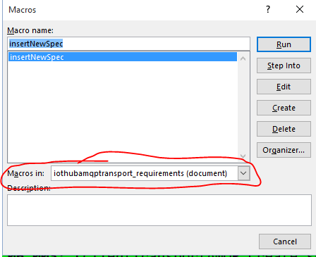
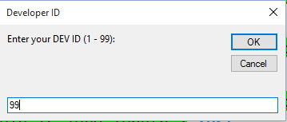

## What to contribute
There are many ways that you can contribute to the Azure IoT SDKs project:

* Submit a bug
* Submit a code fix for a bug
* Submit code to add a new platform/language support to the project, or modify existing code
* Submit additions or modifications to the documentation
* Submit a feature request

The key design principle is that the code makes it easy for people to get data from sensors into Azure IoT services.

## Contributing Code
To contribute code you need to issue a Pull Request. All code submissions will be reviewed and tested by the team, and those that meet a high bar for both quality and design/roadmap appropriateness will be merged into the source. Be sure to follow the existing file/folder structure when adding new boards or sensors.

You must sign a [Contribution License Agreement](https://cla.microsoft.com/) ([CLA](https://cla.microsoft.com/)) before submitting a Pull Request. To complete the CLA, you will need to submit the request via the form and then electronically sign the CLA when you receive the email containing the link to the document.

## Big contributions
If your contribution is significantly big it is better to first check with the project developers in order to make sure the change aligns with the long term plans. This can be done simply by submitting a question via the GitHub Issues section.

## Things to keep in mind when contributing
Some guidance for when you make a contribution:

* Add/update the Visio design diagram when required by your change
* Add/update module requirements as required by your change
* Add/update unit tests and code as required by your change
* Make sure you run all the unit tests on the affected platform(s). If the change is in common code, generally running on one platform would be acceptable
* Run end-to-end tests or simple sample code to make sure the lib works in an end-to-end scenario.

## Editing module requirements
We write detailed module requirements that we trace in the code and unit tests. In order for each small requirement to be traceable it receives an Id. The requirement Id is generated by using a Word macro that is embedded in the requirement document.

The below steps describe adding a new requirement:

* Add the requirement text and select it

* Invoke the macro with the selected text

* Select developer id 99

* Done!

